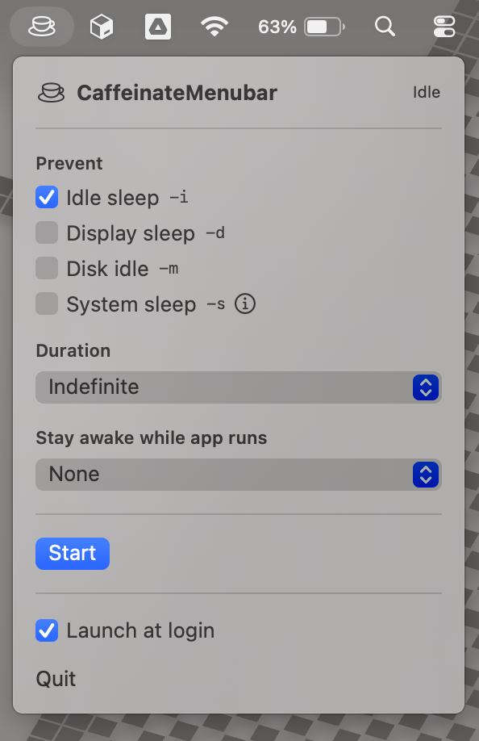

# CaffeinateMenubar

A small, native macOS menubar app that wraps the system `caffeinate` command
with a configurable flag picker, timed sessions, and the option to keep your
Mac awake only while a specific app is running.

Built with Swift + SwiftUI (`MenuBarExtra`). Requires **macOS 13 (Ventura)** or
later. v0.1.0 releases ship **Apple Silicon only**; Intel Macs can build from
source via `swift build`. A universal binary is planned for a follow-up.

[](https://github.com/slastrina/caffeinate-menubar/releases/latest)
[](https://github.com/slastrina/caffeinate-menubar/actions/workflows/release.yml)

<p align="center">
  
</p>

---

## Install

1. Grab the latest `CaffeinateMenubar.zip` from
   [**Releases**](https://github.com/slastrina/caffeinate-menubar/releases/latest).
2. Unzip it. You'll get `CaffeinateMenubar.app`.
3. Drag it into `/Applications`. (Required if you want "Launch at login" to
   work reliably.)
4. Double-click to launch. The cup-and-saucer icon appears in your menubar.

Releases are signed with a Developer ID certificate and notarized by Apple,
so Gatekeeper opens them with no warnings.

## Features

- **Pick exactly which caffeinate flags to apply** before starting a session:
  - `-i` — prevent idle sleep
  - `-d` — prevent display sleep
  - `-m` — prevent disk idle sleep
  - `-s` — prevent system sleep *(only takes effect on AC power)*
- **Timed sessions:** Indefinite / 30 min / 1 hour / 2 hours / Custom
  (any positive number of minutes, no upper bound)
- **Tie a session to a running app** — pick any user-visible app and the
  session ends automatically when that app quits
- **Visual state indicator:** the menubar icon swaps between
  `cup.and.saucer` (idle) and `cup.and.saucer.fill` (active), with a live
  countdown in the dropdown while running
- **Launch at login** (via `SMAppService`)
- **Last-used flags + duration are remembered** across launches

## Usage

Click the menubar icon to open the dropdown:

- **Idle state** — flag toggles, duration picker, and an optional
  "Stay awake while app runs" picker. The **Start** button is disabled until
  you pick at least one flag.
- **Running state** — the dropdown shows the active arguments, a countdown
  (if a duration was set), and a **Stop** button. Quitting the app also stops
  any active session — no orphaned caffeinate processes.

Both a duration *and* an app target can be set at once — whichever condition
fires first ends the session.

## Development

The project is a Swift Package with no third-party runtime dependencies.

```bash
# Build + run (debug)
swift run

# Build a release binary
swift build -c release
# → .build/release/CaffeinateMenubar

# Package as CaffeinateMenubar.app for distribution
./scripts/make-app.sh
# → build/CaffeinateMenubar.app

# Run tests
swift test                # works if full Xcode is installed
./scripts/test.sh         # works with Command Line Tools alone
```

### Project layout

```
Package.swift                       SPM manifest (macOS 13+)
Sources/CaffeinateMenubar/
  CaffeinateMenubarApp.swift        @main App + AppDelegate
  Models/                           CaffeinateFlags, SessionConfig, SessionState
  Services/                         Controller, RunningApps, LaunchAtLogin
  Views/                            FlagPicker, DurationPicker, AppPicker, root
Tests/CaffeinateMenubarTests/       22 swift-testing tests
scripts/
  make-app.sh                       Wraps binary into a .app bundle
  test.sh                           CLT-compatible test wrapper
.github/workflows/release.yml       CI release on v* tag push
SPEC.md                             Specification (read this for design intent)
```

### Tests

The unit tests use Swift's modern `Testing` framework and cover:

- Flag → argv mapping across every combination
- `SessionConfig` validation (empty flags, zero/negative duration, etc.)
- `CaffeinateController` state transitions, including auto-return-to-idle
  when the underlying process exits on its own
- The `CaffeinateProcess` protocol seam means tests don't actually spawn
  `/usr/bin/caffeinate` — see `Tests/CaffeinateMenubarTests/CaffeinateControllerTests.swift`
